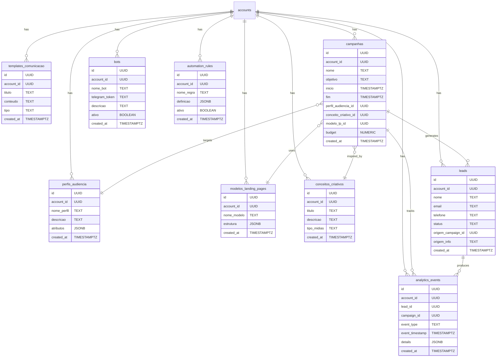
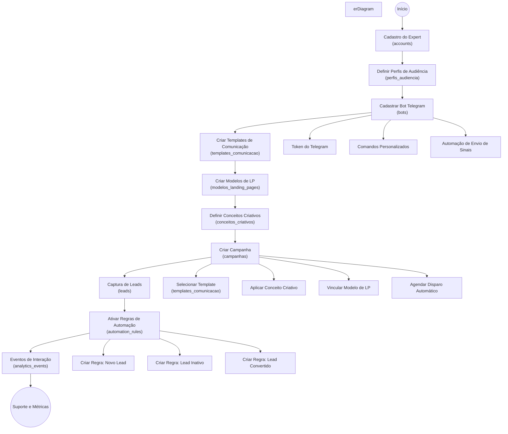
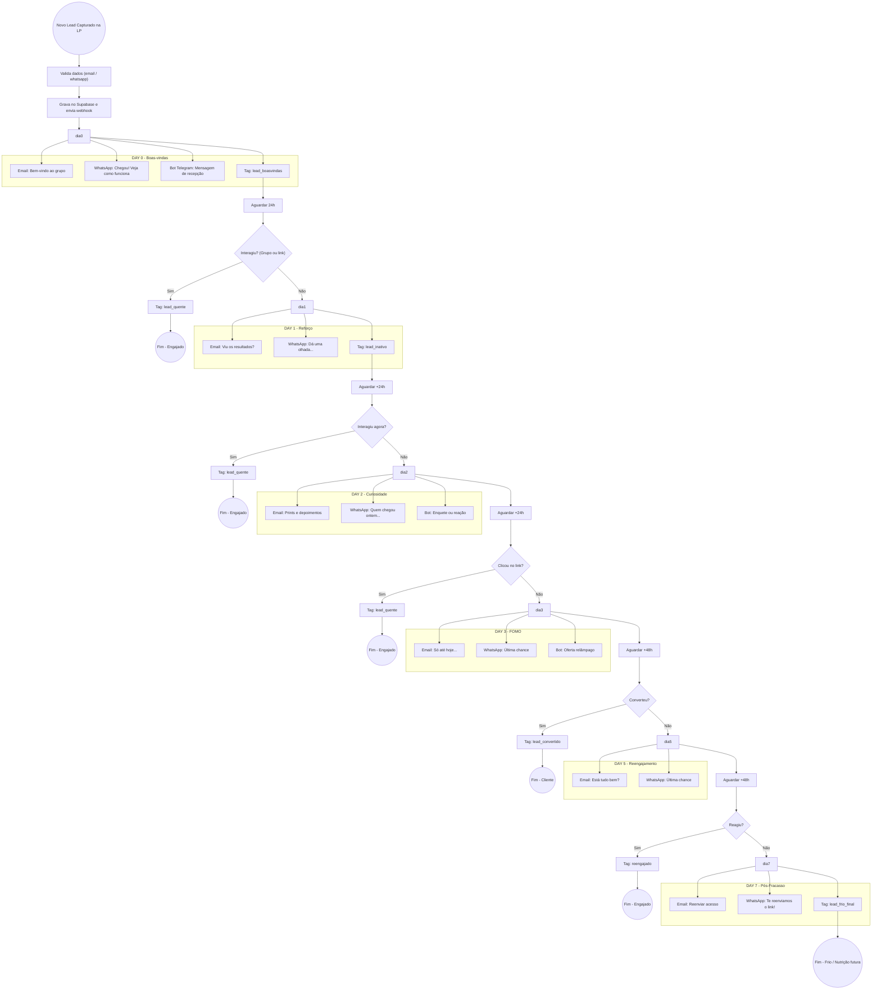
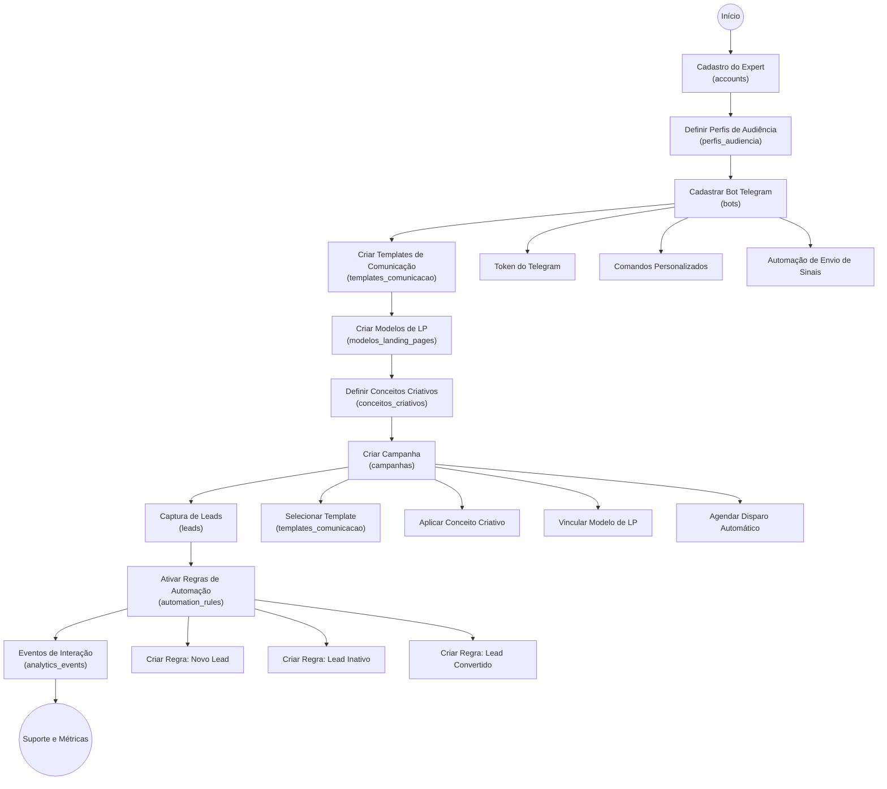

```mermaid
erDiagram
    accounts ||--o{ perfis_audiencia : has
    accounts ||--o{ templates_comunicacao : has
    accounts ||--o{ modelos_landing_pages : has
    accounts ||--o{ conceitos_criativos : has
    accounts ||--o{ campanhas : has
    accounts ||--o{ leads : has
    accounts ||--o{ bots : has
    accounts ||--o{ automation_rules : has
    accounts ||--o{ analytics_events : has

    perfis_audiencia {
        id UUID
        account_id UUID
        nome_perfil TEXT
        descricao TEXT
        atributos JSONB
        created_at TIMESTAMPTZ
    }

    templates_comunicacao {
        id UUID
        account_id UUID
        titulo TEXT
        conteudo TEXT
        tipo TEXT
        created_at TIMESTAMPTZ
    }

    modelos_landing_pages {
        id UUID
        account_id UUID
        nome_modelo TEXT
        estrutura JSONB
        created_at TIMESTAMPTZ
    }

    conceitos_criativos {
        id UUID
        account_id UUID
        titulo TEXT
        descricao TEXT
        tipo_midias TEXT
        created_at TIMESTAMPTZ
    }

    campanhas {
        id UUID
        account_id UUID
        nome TEXT
        objetivo TEXT
        inicio TIMESTAMPTZ
        fim TIMESTAMPTZ
        perfil_audiencia_id UUID
        conceito_criativo_id UUID
        modelo_lp_id UUID
        budget NUMERIC
        created_at TIMESTAMPTZ
    }

    leads {
        id UUID
        account_id UUID
        nome TEXT
        email TEXT
        telefone TEXT
        status TEXT
        origem_campaign_id UUID
        origem_info TEXT
        created_at TIMESTAMPTZ
    }

    bots {
        id UUID
        account_id UUID
        nome_bot TEXT
        telegram_token TEXT
        descricao TEXT
        ativo BOOLEAN
        created_at TIMESTAMPTZ
    }

    automation_rules {
        id UUID
        account_id UUID
        nome_regra TEXT
        definicao JSONB
        ativo BOOLEAN
        created_at TIMESTAMPTZ
    }

    analytics_events {
        id UUID
        account_id UUID
        lead_id UUID
        campaign_id UUID
        event_type TEXT
        event_timestamp TIMESTAMPTZ
        details JSONB
        created_at TIMESTAMPTZ
    }

    campanhas ||--o{ leads : generates
    campanhas ||--o{ analytics_events : tracks
    leads ||--o{ analytics_events : produces
    campanhas }o--|| perfis_audiencia : targets
    campanhas }o--|| conceitos_criativos : inspired_by
    campanhas }o--|| modelos_landing_pages : uses
```

```mermaid
flowchart TD
erDiagram
 %% Fluxo geral do onboarding de um expert
  start((Início))
  start --> cadastro_expert["Cadastro do Expert<br>(accounts)"]
cadastro_expert --> definir_perfis["Definir Perfis de Audiência<br>(perfis_audiencia)"]
definir_perfis --> configurar_bot["Cadastrar Bot Telegram<br>(bots)"]
configurar_bot --> criar_templates["Criar Templates de Comunicação<br>(templates_comunicacao)"]
criar_templates --> criar_lp_modelos["Criar Modelos de LP<br>(modelos_landing_pages)"]
criar_lp_modelos --> criar_conceitos["Definir Conceitos Criativos<br>(conceitos_criativos)"]
criar_conceitos --> criar_campanha["Criar Campanha<br>(campanhas)"]
criar_campanha --> capturar_leads["Captura de Leads<br>(leads)"]
capturar_leads --> ativar_automacoes["Ativar Regras de Automação<br>(automation_rules)"]
ativar_automacoes --> registrar_eventos["Eventos de Interação<br>(analytics_events)"]
registrar_eventos --> fim((Suporte e Métricas))

%% Subfluxo de Campanha
criar_campanha --> selecionar_template["Selecionar Template<br>(templates_comunicacao)"]
criar_campanha --> aplicar_conceito["Aplicar Conceito Criativo"]
criar_campanha --> vincular_lp["Vincular Modelo de LP"]
criar_campanha --> agendar_disparo["Agendar Disparo Automático"]

%% Subfluxo de Automação
ativar_automacoes --> regra_nova["Criar Regra: Novo Lead"]
ativar_automacoes --> regra_inativo["Criar Regra: Lead Inativo"]
ativar_automacoes --> regra_convertido["Criar Regra: Lead Convertido"]

%% Subfluxo de Bot
configurar_bot --> configurar_token["Token do Telegram"]
configurar_bot --> ativar_comandos["Comandos Personalizados"]
configurar_bot --> integração_sinais["Automação de Envio de Sinais"]
```

```mermaid
flowchart TD

start((Novo Lead Capturado na LP))
start --> validaDados["Valida dados (email / whatsapp)"]
validaDados --> gravaLead["Grava no Supabase e envia webhook"]
gravaLead --> dia0

subgraph DAY0 ["DAY 0 - Boas-vindas"]
  dia0_email["Email: Bem-vindo ao grupo"]
  dia0_whatsapp["WhatsApp: Chegou! Veja como funciona"]
  dia0_bot["Bot Telegram: Mensagem de recepção"]
  dia0_tag["Tag: lead_boasvindas"]
end

dia0 --> dia0_email
dia0 --> dia0_whatsapp
dia0 --> dia0_bot
dia0 --> dia0_tag

dia0_tag --> aguarda1["Aguardar 24h"]
aguarda1 --> verifica1{"Interagiu? (Grupo ou link)"}

verifica1 -- Sim --> tagQuente1["Tag: lead_quente"] --> fimEngajado1((Fim - Engajado))

verifica1 -- Não --> dia1

subgraph DAY1 ["DAY 1 - Reforço"]
  email1["Email: Viu os resultados?"]
  whatsapp1["WhatsApp: Dá uma olhada..."]
  tagInativo1["Tag: lead_inativo"]
end

dia1 --> email1
dia1 --> whatsapp1
dia1 --> tagInativo1

tagInativo1 --> aguarda2["Aguardar +24h"]
aguarda2 --> verifica2{"Interagiu agora?"}

verifica2 -- Sim --> tagQuente2["Tag: lead_quente"] --> fimEngajado2((Fim - Engajado))

verifica2 -- Não --> dia2

subgraph DAY2 ["DAY 2 - Curiosidade"]
  email2["Email: Prints e depoimentos"]
  whatsapp2["WhatsApp: Quem chegou ontem..."]
  bot2["Bot: Enquete ou reação"]
end

dia2 --> email2
dia2 --> whatsapp2
dia2 --> bot2

dia2 --> aguarda3["Aguardar +24h"]
aguarda3 --> verifica3{"Clicou no link?"}

verifica3 -- Sim --> tagQuente3["Tag: lead_quente"] --> fimEngajado3((Fim - Engajado))

verifica3 -- Não --> dia3

subgraph DAY3 ["DAY 3 - FOMO"]
  email3["Email: Só até hoje..."]
  whatsapp3["WhatsApp: Última chance"]
  bot3["Bot: Oferta relâmpago"]
end

dia3 --> email3
dia3 --> whatsapp3
dia3 --> bot3

dia3 --> aguarda4["Aguardar +48h"]
aguarda4 --> verifica4{"Converteu?"}

verifica4 -- Sim --> tagConvertido["Tag: lead_convertido"] --> fimComprador((Fim - Cliente))

verifica4 -- Não --> dia5

subgraph DAY5 ["DAY 5 - Reengajamento"]
  email5["Email: Está tudo bem?"]
  whatsapp5["WhatsApp: Última chance"]
end

dia5 --> email5
dia5 --> whatsapp5
dia5 --> aguarda6["Aguardar +48h"]
aguarda6 --> verifica5{"Reagiu?"}

verifica5 -- Sim --> tagQuente5["Tag: reengajado"] --> fimEngajado5((Fim - Engajado))

verifica5 -- Não --> dia7

subgraph DAY7 ["DAY 7 - Pós-Fracasso"]
  email7["Email: Reenviar acesso"]
  whatsapp7["WhatsApp: Te reenviamos o link!"]
  tagFrio["Tag: lead_frio_final"]
end

dia7 --> email7
dia7 --> whatsapp7
dia7 --> tagFrio --> fimFrio((Fim - Frio / Nutrição futura))
```

```mermaid
flowchart TD

%% Fluxo geral do onboarding de um expert
start((Início))
start --> cadastro_expert["Cadastro do Expert<br>(accounts)"]
cadastro_expert --> definir_perfis["Definir Perfis de Audiência<br>(perfis_audiencia)"]
definir_perfis --> configurar_bot["Cadastrar Bot Telegram<br>(bots)"]
configurar_bot --> criar_templates["Criar Templates de Comunicação<br>(templates_comunicacao)"]
criar_templates --> criar_lp_modelos["Criar Modelos de LP<br>(modelos_landing_pages)"]
criar_lp_modelos --> criar_conceitos["Definir Conceitos Criativos<br>(conceitos_criativos)"]
criar_conceitos --> criar_campanha["Criar Campanha<br>(campanhas)"]
criar_campanha --> capturar_leads["Captura de Leads<br>(leads)"]
capturar_leads --> ativar_automacoes["Ativar Regras de Automação<br>(automation_rules)"]
ativar_automacoes --> registrar_eventos["Eventos de Interação<br>(analytics_events)"]
registrar_eventos --> fim((Suporte e Métricas))

%% Subfluxo de Campanha
criar_campanha --> selecionar_template["Selecionar Template<br>(templates_comunicacao)"]
criar_campanha --> aplicar_conceito["Aplicar Conceito Criativo"]
criar_campanha --> vincular_lp["Vincular Modelo de LP"]
criar_campanha --> agendar_disparo["Agendar Disparo Automático"]

%% Subfluxo de Automação
ativar_automacoes --> regra_nova["Criar Regra: Novo Lead"]
ativar_automacoes --> regra_inativo["Criar Regra: Lead Inativo"]
ativar_automacoes --> regra_convertido["Criar Regra: Lead Convertido"]

%% Subfluxo de Bot
configurar_bot --> configurar_token["Token do Telegram"]
configurar_bot --> ativar_comandos["Comandos Personalizados"]
configurar_bot --> integração_sinais["Automação de Envio de Sinais"]
```